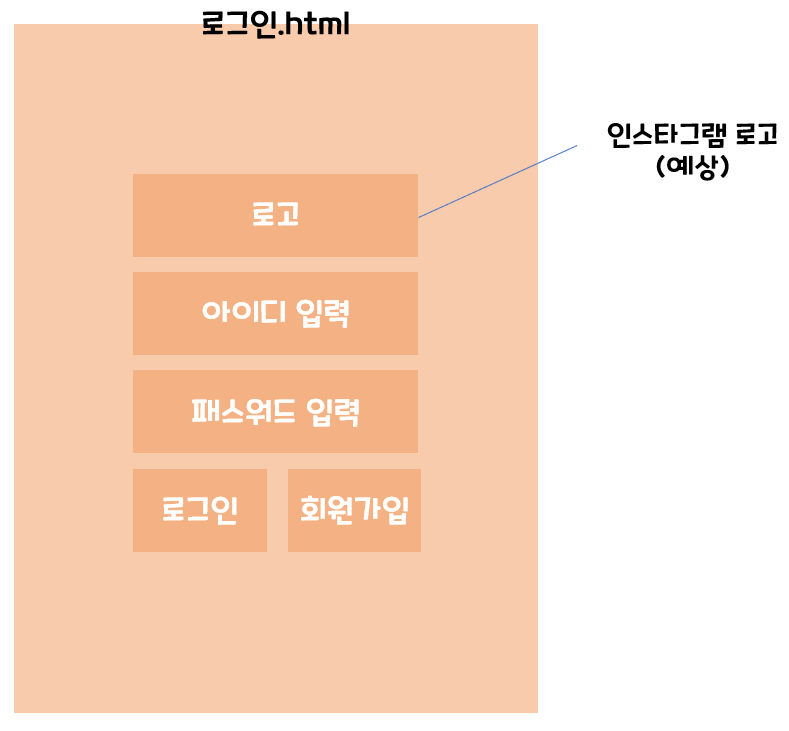
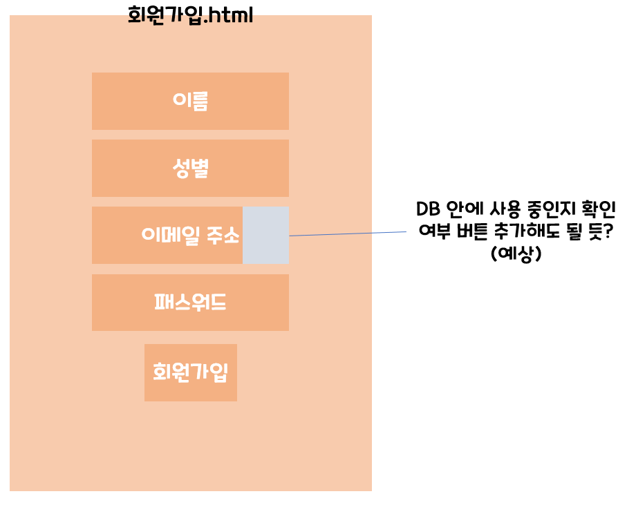
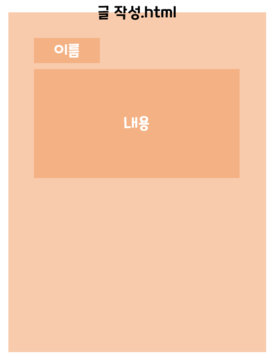
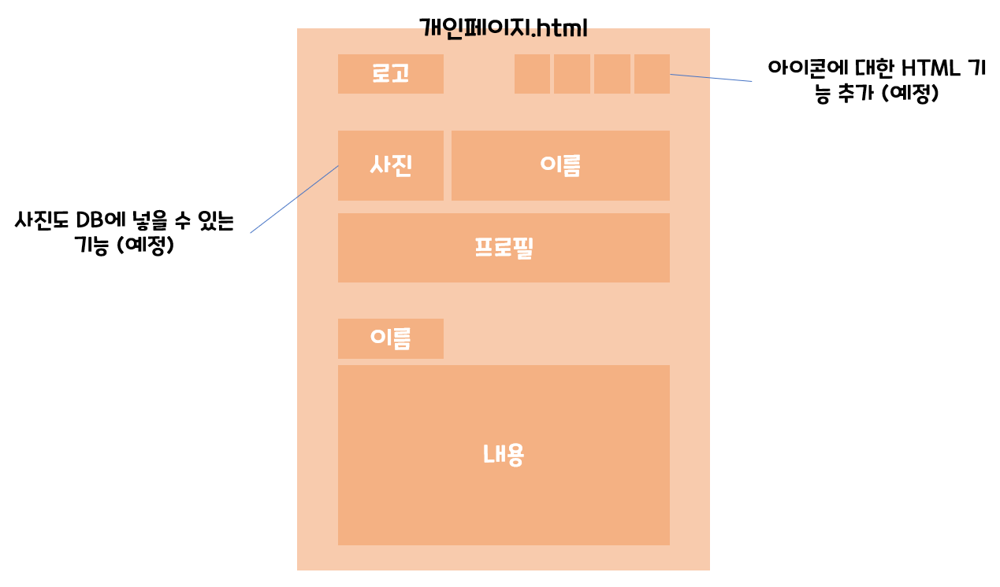
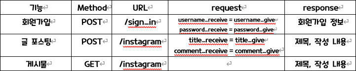

# Instagram Clone Coding
> Start : 2021.12.28 ~

## 프로젝트
1. 제목 :  인스타 그램 클론 코딩
2. 설명 : 서버(Flask)를 사용하고 mongoDB로 회원의 정보를 받습니다. 게시물을 입력할 수 있고 이를 나의 페이지에서 확인할 수 있습니다.

## 팀 구성
- 조장 : 최승대(백엔드)
- 조원 : 강형국(백엔드), 김나현(프론트엔드), 이성호(프론트엔드), 김성연(프론트엔드)

## 와이어 프레임 사진

    
    
    
     
    

